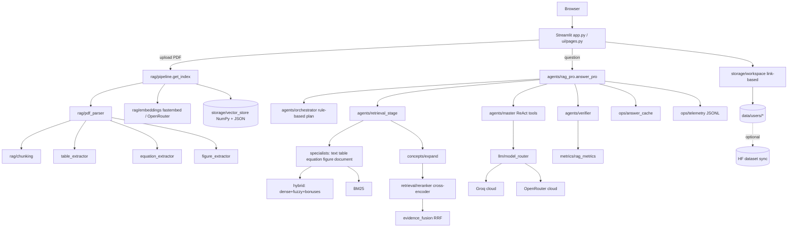
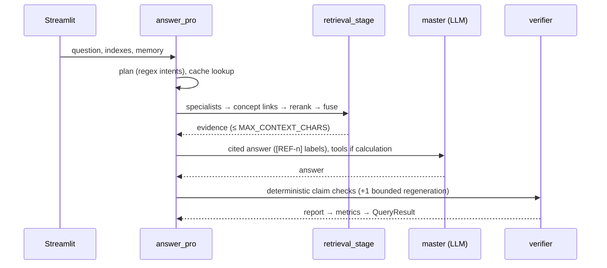

# Existing Architecture (baseline, before transformation)

```mermaid
flowchart TD
    U[Browser] --> ST[Streamlit app.py / ui/pages.py]
    ST -->|upload PDF| PL[rag/pipeline.get_index]
    PL --> PP[rag/pdf_parser] --> CH[rag/chunking]
    PP --> TB[table_extractor] & EQ[equation_extractor] & FG[figure_extractor]
    PL --> EM[rag/embeddings fastembed / OpenRouter]
    PL --> VS[(storage/vector_store NumPy + JSON)]
    ST -->|question| RP[agents/rag_pro.answer_pro]
    RP --> OR[agents/orchestrator rule-based plan]
    RP --> RS[agents/retrieval_stage]
    RS --> SP[specialists: text table equation figure document]
    SP --> HY[hybrid: dense+fuzzy+bonuses] & BM[BM25]
    RS --> CL[concepts/expand] --> RR[retrieval/reranker cross-encoder] --> FU[evidence_fusion RRF]
    RP --> MA[agents/master ReAct tools] --> MR[llm/model_router]
    MR --> GQ[Groq cloud] & ORT[OpenRouter cloud]
    RP --> VF[agents/verifier] --> MET[metrics/rag_metrics]
    RP --> CA[ops/answer_cache] & TEL[ops/telemetry JSONL]
    ST --> WS[storage/workspace link-based] --> FS[(data/users/*)]
    FS -. optional .-> HF[(HF dataset sync)]
```

## Request sequence

```mermaid
sequenceDiagram
    participant UI as Streamlit
    participant P as answer_pro
    participant R as retrieval_stage
    participant M as master (LLM)
    participant V as verifier
    UI->>P: question, indexes, memory
    P->>P: plan (regex intents), cache lookup
    P->>R: specialists → concept links → rerank → fuse
    R-->>P: evidence (≤ MAX_CONTEXT_CHARS)
    P->>M: cited answer ([REF-n] labels), tools if calculation
    M-->>P: answer
    P->>V: deterministic claim checks (+1 bounded regeneration)
    V-->>P: report → metrics → QueryResult
```

Detail of every module: see the original `ARCHITECTURE.md` (kept and extended in Phase 12).
